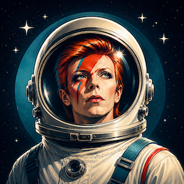
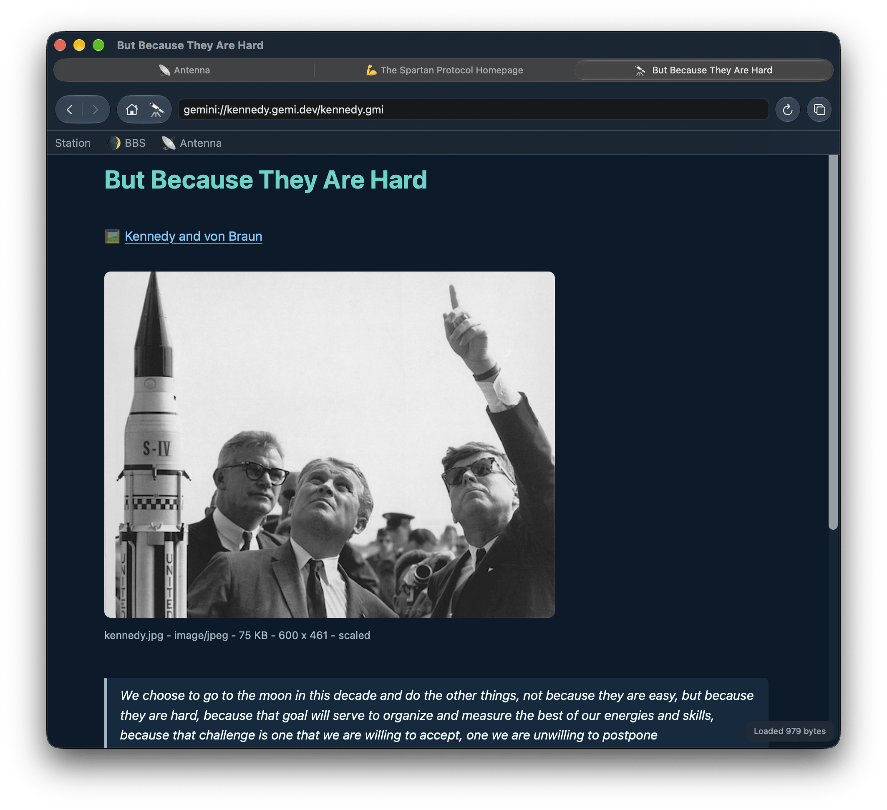
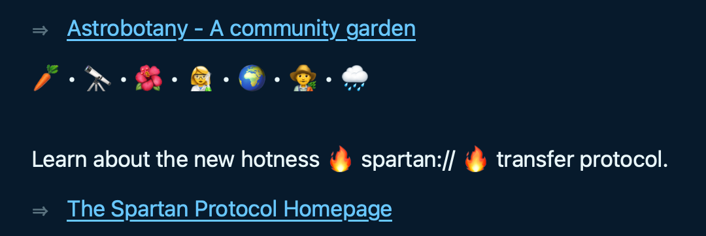
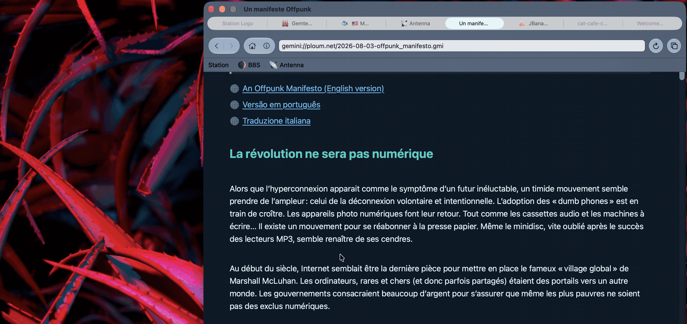

# Major Tom

Major Tom aims to be the best client for browsing [Geminispace](https://geminiprotocol.net/) on macOS. Unapologetically a [Mac-assed Mac App](https://macassedmacapps.com), Major Tom features beautiful typography, full-color Emoji, iCloud-syncing, and all the macOS native controls and features you should expect. It feels like Safari, but for the smolweb.

## Gallery

Video demoing the many features:

https://github.com/user-attachments/assets/7967524a-e630-4578-9ad8-218c08f817d9

Native text rendering and Apple's Emoji:

Language translation that never leaves your machine using macOS's built in capabilities:

## Features

### UI

* Multiple windows, multiple tabs per window.
* Native controls, menus, context menus, keyboard shortcuts, text selection, find dialogs, drag and drop, save panels, and more.
* Light mode / Dark mode support for application appearance.
* Swipes and gestures for navigation, just like Safari.

### Content

* Beautiful, native typography with full Unicode and color-emoji support 🎨🌮!
* Content themes and reading widths settings
* Inline rendering of images
* Rendering of inline Markdown-like styles including **\*\*bold\*\***, *\*italics\**, and ``monospace``.
* ANSI colors and text styles for capsule ASCII art, adjusted for readability on your content theme.
* Support Gemini Capsule [Favicons](gemini://mozz.us/files/rfc_gemini_favicon.gmi).
* Streaming support: pages start to render while content is still arriving, allowing for streaming applications.

### Experience

* A unified address and search bar, with custom search providers for [Kennedy](gemini://kennedy.gemi.dev/), [TLGS](gemini://tlgs.one), and other Gemini search engines.
* Searchable browsing history
* Bookmarks with folders, a Favorites bar, and a built-in bookmark manager.
* iCloud Tabs, with links to the pages open on your other Macs.
* Session restoration which remembers your windows, tabs, and place on the page.
* Saved drafts for unfinished Gemini input prompts, so you never lose a thought.
* Supports client-side certificates/identities for interactive Gemini capsules like Station or BBS.
* Suggestions from [Delorean Time Machine](gemini://kennedy.gemi.dev/archive/) when a capsule or resource is unavailable.
* Importing bookmarks, client certificates, and other supported data from Lagrange and Alhena.

## Getting Major Tom

Soon to be available via Apple's Mac App Store!

Release available via GitHub [GitHub Releases page](https://github.com/acidus99/MajorTom/releases).

## Help Wanted

I would appreciate opening bugs feature requests on Github or reach out to me via `gemini://gemi.dev/contact.gmi`
